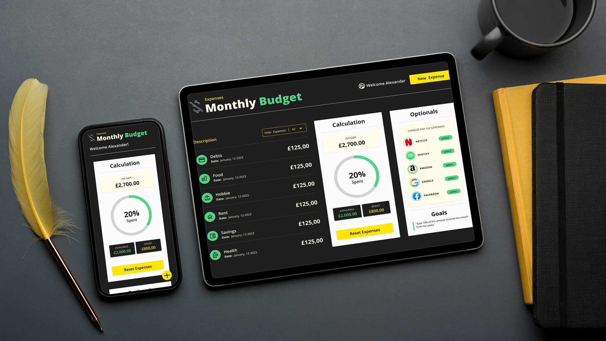

# Expense Tracker

A simple and intuitive web-based expense tracker application built with React and Figma. This application allows users to keep track of their daily expenses and categorize them into various categories. 

The design was created using Figma and the development was done using React, making it fast and user-friendly. The application is designed to help users stay on top of their finances and achieve their budgeting goals.

